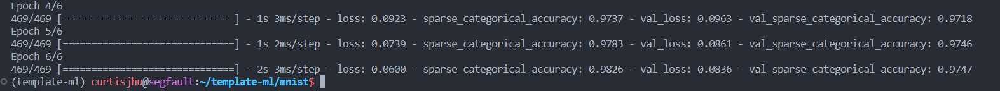

## Template MNIST

Fundmentally, $ \text{data collection, cleaning, augmentation}  \rightarrow \text{training pipeline}  \rightarrow \text{testing pipeline} \rightarrow \text{model} $

## Getting Started for PyTorch
In your `template-ml` conda env:
```
python pytorch.py
```

### PyTorch Model

MODEL | BATCHES | EPOCHS | ACCURACY
--- | --- | --- | ---
pytorch-model-1 | 32 | 5 | 98.98 %


Model is a convolutional neural network with max pooling:
```
Using device:cpu
Parameters 13248
----------------------------------------------------------------
        Layer (type)               Output Shape         Param #
================================================================
            Conv2d-1           [-1, 16, 28, 28]             416
              ReLU-2           [-1, 16, 28, 28]               0
         MaxPool2d-3           [-1, 16, 14, 14]               0
            Conv2d-4           [-1, 32, 14, 14]          12,832
              ReLU-5           [-1, 32, 14, 14]               0
         MaxPool2d-6             [-1, 32, 7, 7]               0
           Flatten-7                 [-1, 1568]               0
           Softmax-8                 [-1, 1568]               0
================================================================
Total params: 13,248
Trainable params: 13,248
Non-trainable params: 0
----------------------------------------------------------------
Input size (MB): 0.00
Forward/backward pass size (MB): 0.35
Params size (MB): 0.05
Estimated Total Size (MB): 0.40
```

In mathematical form:
... how do you describe conv2d in math?


https://towardsdatascience.com/going-beyond-99-mnist-handwritten-digits-recognition-cfff96337392


## Getting Started for Tensorflow

In your `template-ml` conda env:
```
python tf.py
```

### Tensorflow Model

MODEL | BATCHES | EPOCHS | ACCURACY
--- | --- | --- | ---
tf-model-1 | entire dataset | 8 | 98.98 %



```
Model: "sequential"
_________________________________________________________________
 Layer (type)                Output Shape              Param #   
=================================================================
 flatten (Flatten)           (None, 784)               0         
                                                                 
 dense (Dense)               (None, 128)               100480    
                                                                 
 dense_1 (Dense)             (None, 10)                1290      
                                                                 
=================================================================
Total params: 101,770
Trainable params: 101,770
Non-trainable params: 0
_________________________________________________________________
```

